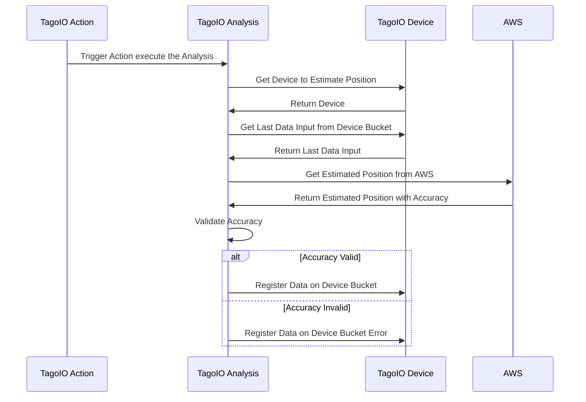

# TagoIO - AWS IOT Core Device Location Integration
AWS IOT Core Device Location is a service from AWS that may permit you to estimate the location of your device using third-party solvers and don’t need the use of a GPS device, more about it in the documentation.

# How to Run This Analysis

## Prerequisites
- Ensure you have the latest version of Node.js installed on your system.

## Option 1: Upload to TagoIO Platform

1. Simply upload the `analysis.tago.js` file to your TagoIO account.

## Option 2: Run Locally

1. Open a terminal and navigate to the project folder.
2. Install dependencies:
   ```
   npm install
   ```
3. Run the analysis:
   ```
   node analysis.js
   ```

## Building the Analysis

To build the analysis for deployment:

1. Install the TagoIO builder tool globally:
   ```
   npm install -g @tago-io/builder
   ```
2. Pack the analysis using the command:
   ```
   tago-builder src/analysis.ts ./
   ```
# Sequence diagram of that integration

