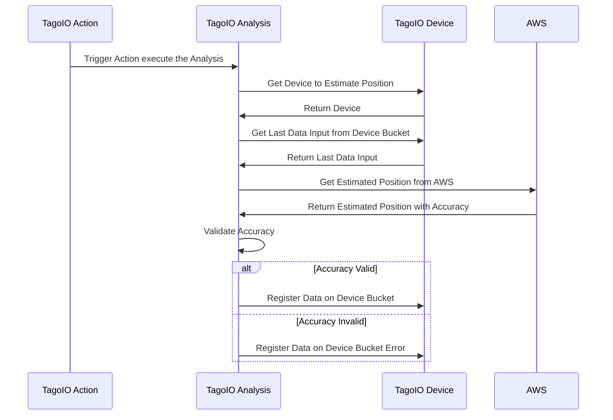

# AWS IoT Core Device Location Integration
Using AWS IoT Core Device Location to estimate the location of your device without using GPS.

## How to run this analysis
You should have last node version and install all dependencies running `npm install` on your terminal in this project folder.
You need to run `tagoio init` to login in your TagoIO account and set the analysis to execute.

To run locally you need to run the command `tagoio run`

or

You should run `tagoio deploy` to run this analysis on TagoIO servers.

# Sequence diagram of that integration

